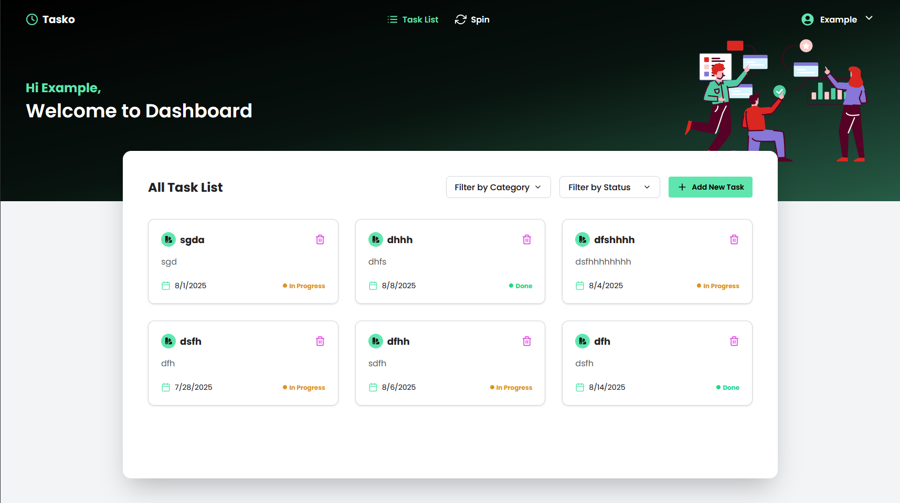

# Tasko - MERN Task Management Web Application

Tasko is a full-stack task management app built with the MERN stack. It allows users to create, manage, and update tasks, featuring a fun spinning wheel for random task selection. The UI is designed to be responsive and follows the provided Figma design.

---

## 🚀 Live Website

[Live Demo Link](https://your-live-site-link.com)

## 📦 GitHub Repository

[GitHub Repo Link](https://github.com/your-username/tasko)

---

## 📸 Screenshots



---

## 🛠️ Tools & Packages Used

### Frontend
- React
- Vite
- TailwindCSS
- DaisyUI
- React Icons
- Axios
- React Router

### Backend
- Node.js
- Express
- MongoDB & Mongoose
- JWT
- bcryptjs
- Helmet
- CORS
- cookie-parser
- express-validator

---

## 🗂️ Project Structure

### Backend (`server`)
```
server/
├── src/
│   ├── app.js
│   ├── config/
│   ├── controllers/
│   ├── middlewares/
│   ├── models/
│   ├── routes/
│   ├── services/
│   └── utils/
├── .env
├── index.js
├── package.json
```

### Frontend (`client`)
```
client/
├── src/
│   ├── assets/
│   ├── components/
│   ├── context/
│   ├── pages/
│   ├── routes/
│   └── utils/
├── index.html
├── package.json
```

---

## ✨ Features

- User Authentication (Signup, Login, Logout, Password Reset)
- Task CRUD (Create, Read, Update, Delete)
- Task Filtering (by Category & Status)
- Fun Spin Wheel for Random Task Selection
- Responsive UI (Mobile & Desktop)
- Protected Routes
- User Points & Level System
- Error Handling & Validation
- Secure HTTP Headers & CORS

---

## 📋 Setup Instructions

1. **Clone the repository**
   ```sh
   git clone https://github.com/your-username/tasko.git
   cd tasko
   ```

2. **Backend Setup**
   ```sh
   cd server
   npm install
   # Add your .env file with MONGO_URI and JWT_SECRET
   npm run dev
   ```

3. **Frontend Setup**
   ```sh
   cd ../client
   npm install
   npm run dev
   ```

4. **Open [http://localhost:5173](http://localhost:5173) in your browser**

---

## 📄 Submission

- [Submit your project here](https://docs.google.com/forms/d/e/1FAIpQLSfkpe3kWrZQOb1bQXNhGXVxidwwXY8Lezw1_AeEocKTIfO54w/viewform?usp=dialog)

---

## 📝 Notes

- The UI strictly follows the provided [Figma design](https://www.figma.com/design/5iMEaU0uMrI5AWsAxHfkba/fives_m32220_FO2186F5A8386--Copy-?node-id=17945-20444&m=dev).
- Error handling and validation are implemented on both frontend and backend.
- The app is ready for deployment (Vercel/Netlify for frontend, Render/Heroku for backend, MongoDB Atlas).

---

## 🙏 Thank You!

Feel free to reach out for any
